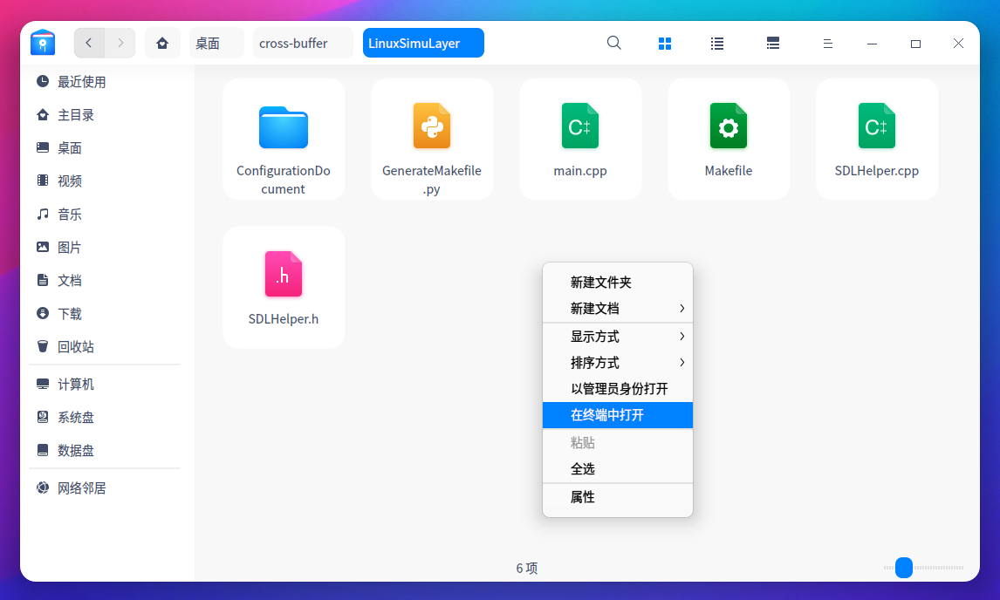

# 如何编译并运行Demo？ (Linux 平台)

1. 开始之前，请确保你的Linux是基于Debian发行版开发的，或者它可以使用apt-get工具。当然，你也可以使用任何你想使用的发行版，但你就可能需要自己搞定问题。下面的操作在Deepin Linux 20的环境下通过了测试，你也可以使用Ubuntu，但如果使用Arch Linux等不包含apt-get工具的Linux发行版就无法运行。确保你选择适合的系统。

2. 进入到LinuxSimuLayer文件夹，右键，选择"在终端中打开"。你也可以使用其他自己喜欢的方式打开终端。

   

3. 输入如下指令并按回车键执行：

   ```bash
   make installDependencies
   ```

   这个命令将会帮你**安装所有的依赖**，完全不用你自己做痛苦的配置环境的工作。

4. 输入如下指令并按回车键执行：

   ```bash
   make run
   ```

   程序将会**自动编译并运行**，所有的这些操作都是**自动的**。你甚至不需要明白怎么写Makefile，因为这个工程用了一些**骚操作**，当你执行make指令时，Linux自带的make将会根据Makefile文件中的规则编译。但工程并不总是不变的，这个makefile的独特之处在于它会自动检测你有没有新建.cpp文件，如果有，他就**会自己重写自己的规则**，来编译你新建的文件。

5. 运行之后，工程中会多出很多.o结尾的临时文件，输入如下指令并按回车键执行：

   ```bash
   make clear
   ```
   这可以清除所有的.o临时文件。

