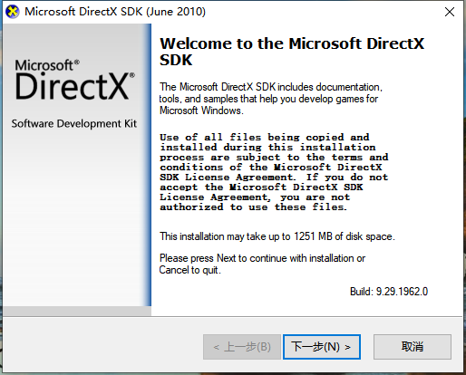
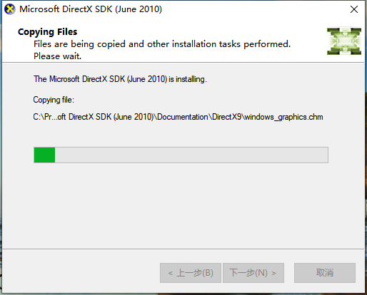
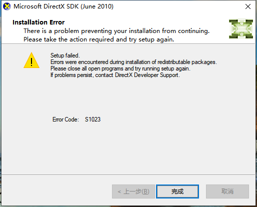
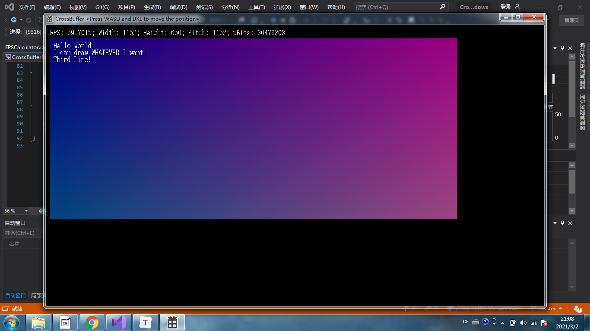
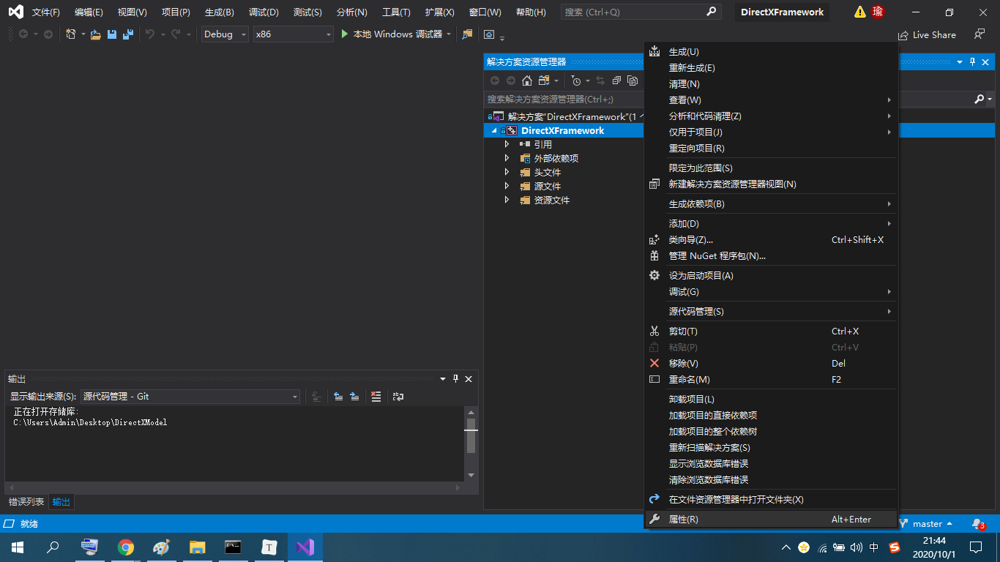
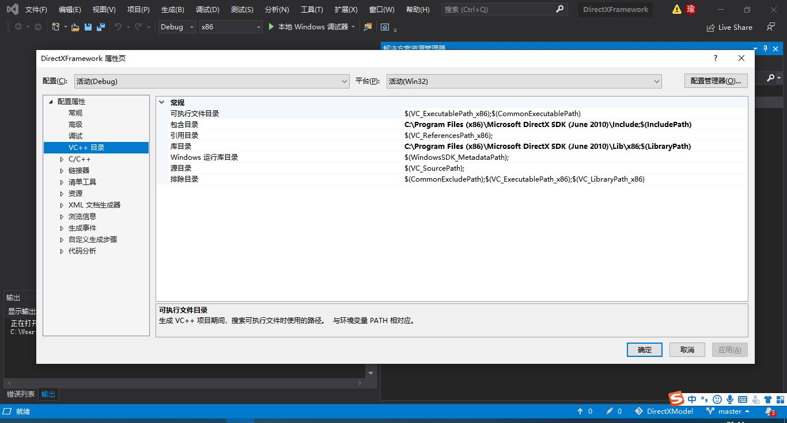
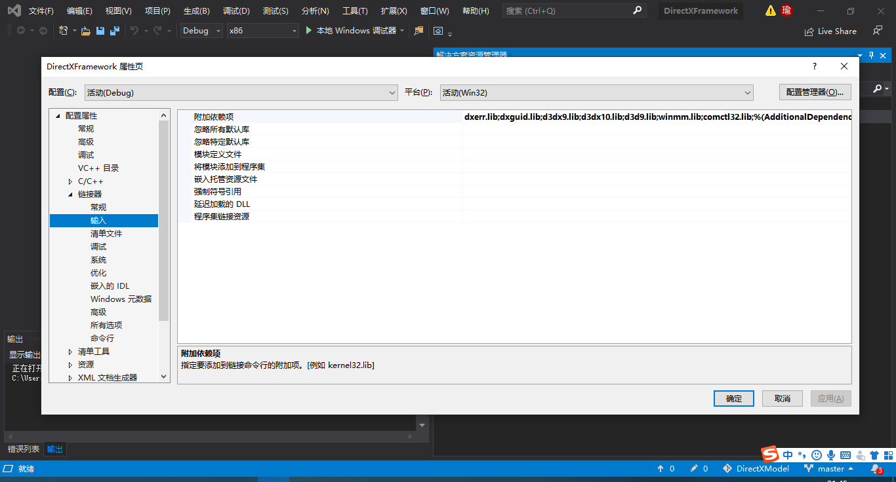

# 如何编译并运行Demo？ (Windows 平台)

1.下载并运行DirectX9.0 SDK安装包（DXSDK_Jun10.exe，2010年6月发布），由于时间久远，安装包比较难找，在这里放两个链接：

- Gitee仓库：[https://gitee.com/SirJackie/good-software-backup](https://gitee.com/SirJackie/good-software-backup) ，clone下来后有一个DXSDK_Jun10文件夹，里面有分块的压缩包(DXSDK_Jun10.part01.rar到DXSDK_Jun10.part14.rar)，用WinRAR可以解压，得到一个大小571.7MB的DXSDK_Jun10.exe。
- 百度网盘（侵删）： [http://pan.baidu.com/s/1gfkqSMZ](http://pan.baidu.com/s/1gfkqSMZ) 密码: r6my

得到DXSDK_Jun10.exe之后，双击运行：

2.安装路径**<u>务必</u>**安装到到C:\Program Files (x86)\Microsoft DirectX SDK (June 2010)，**<u>否则你就需要重新配置Visual Studio项目</u>**（重新配置的教程见下文）。默认地址就是这个。

3.安装程序最终会出现S1023错误，但这是正常现象，不影响使用。

4.安装完成后打开仓库中的CrossBufferForWindow.vcxproj，就会自动在VS中打开CrossBufferForWindow项目。点击画面上方的“本地Windows调试器”进行编译运行。不出所料的话，你应该会看到下图所示的Demo。Windows7环境轻松60帧，Windows10环境只能跑到48-50帧，这可能是因为系统的实现不同导致的。

# 重新配置Visual Studio项目

如果你不想使用我配置好的Visual Studio项目，或者你的项目损坏，可以这样配置：

1.新建一个VS窗口程序，按照我的项目设置把相应.h和.cpp文件添加进去。

2.在右边的“解决方案管理器”中右击项目，点属性，然后按照下面三张图设置：

3.设置完成后就可以使用了。如果有什么问题，请Issue我，我会尽快解答！