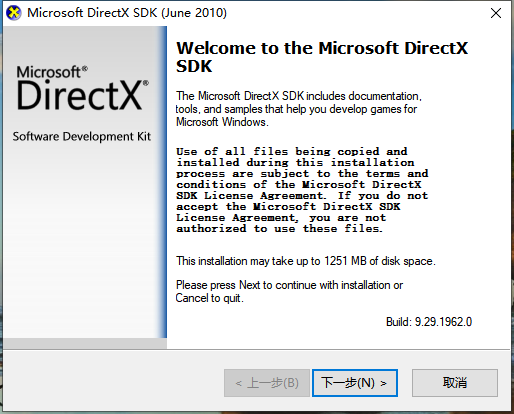
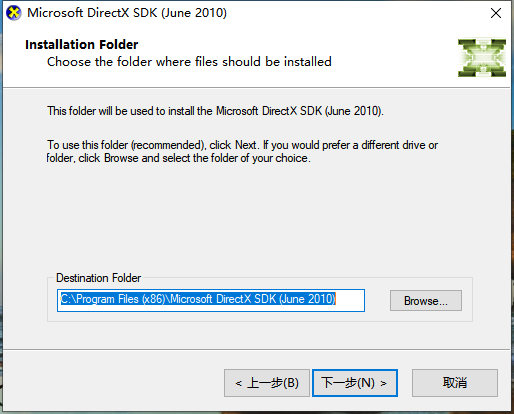
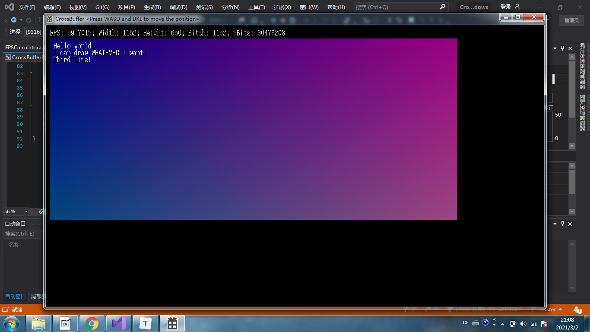
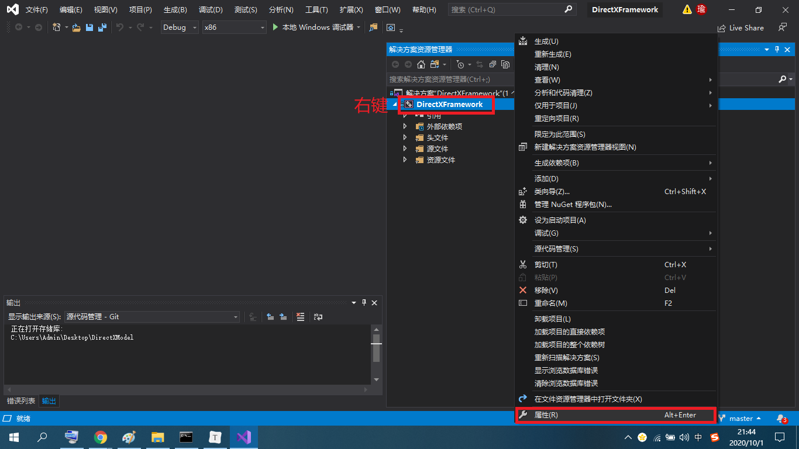
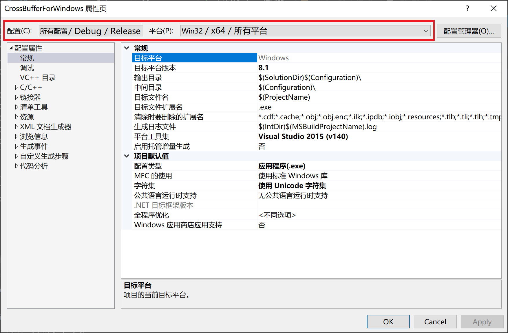
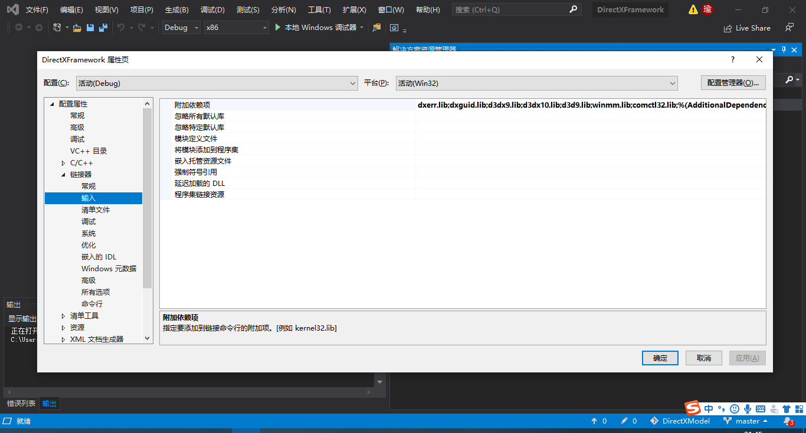
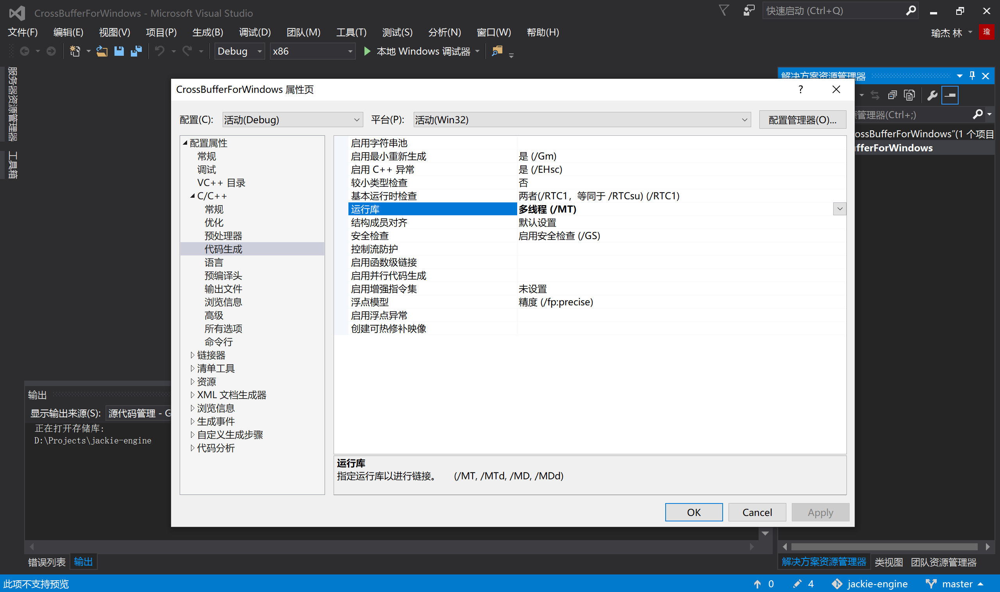

# 如何编译并运行Demo？ (Windows 平台)

## 1. 简单编译方法

1. 编译之前，确定您已经安装好 Visual Studio 2015 Update 3，更高版本的不保证能够正常编译运行。

2. 本3D引擎虽然是一个完全基于数学运算的软渲染3D引擎，不依赖GPU硬件加速，完全基于CPU运算实现软件渲染，但由于需要操控显示器显存来绘制2D图形，会依赖于DirectX9.0 SDK，所以运行本3D引擎前，请先安装DirectX9.0 SDK。

3. 首先，下载并运行DirectX9.0 SDK安装包（DXSDK_Jun10.exe，2010年6月发布），由于时间久远，安装包比较难找，在这里放两个链接：

   - Gitee仓库：[https://gitee.com/SirJackie/good-software-backup](https://gitee.com/SirJackie/good-software-backup) ，clone下来后有一个DXSDK_Jun10文件夹，里面有分块的压缩包(DXSDK_Jun10.part01.rar到DXSDK_Jun10.part14.rar)，用WinRAR可以解压，得到一个大小571.7MB的DXSDK_Jun10.exe。
   - 百度网盘（侵删）： [http://pan.baidu.com/s/1gfkqSMZ](http://pan.baidu.com/s/1gfkqSMZ) 密码: r6my

4. 得到DXSDK_Jun10.exe之后，双击运行：

   

5. 安装路径**<u>务必</u>**安装到到C:\Program Files (x86)\Microsoft DirectX SDK (June 2010)，**<u>否则你就需要重新配置Visual Studio项目</u>**（重新配置的教程见下文）。默认地址就是这个。

   

   

6. 安装程序最终会出现S1023错误，但这是正常现象，不影响使用：

   

7. 安装完成后打开仓库中的`CrossBufferForWindows.sln`或者`CrossBufferForWindows.vcxproj`，就会自动在VS中打开`CrossBufferForWindows`项目，本项目基于`CrossBufferForWindows`框架开发，这个项目提供了非常简便的操作显存的API供开发者使用，`CrossBufferForWindows`框架也是本作者开发的。

8. 点击画面上方的“本地Windows调试器”进行编译运行，请注意，务必要选择Debug + x86组合或者Release + x86组合进行编译，任何使用x64编译的组合都会失败，因为DirectX9.0 SDK的64为支持需要另外配置：

   

9. 不出所料的话，你应该会看到下图所示的Demo。我使用 AMD Ryzen 7 5000 Series 的 CPU，搭配 NVIDIA GeForce RTX 3060 的显卡，在165Hz高刷新率显示器下运行，可以达到如下帧数：

   > `Debug   + x86`：40到60FPS
   >
   > `Release + x86`：163到165FPS

   可以看到，Debug模式下由于安全监测的Debugger的原因，导致帧率降低，如果需要高帧数运行，应该选择`Release + x86`组合。

   

## 2. 进阶编译方法：自定义编译选项

### 2-1. 进入项目设置：

打开项目，在右边的“解决方案管理器”中右击项目，点属性，就可以进入项目设置：



### 2-2. 选择所设置的平台

务必注意您正在设置哪一个平台，目前共有4个平台：Debug x86, Release x86, Debug x64, Release x64，四个平台设置互不相同，请确定您所设置的平台，就是您所选择的编译平台（两个红色框框要对应）：




### 2-3. 配置包含目录和库目录（Include和Lib）

在项目设置——VC++目录中进行设置：


以下是标准的路径，用于参考：

```
包含目录：C:\Program Files (x86)\Microsoft DirectX SDK (June 2010)\Include
库目录：C:\Program Files (x86)\Microsoft DirectX SDK (June 2010)\Lib\x86
```

### 2-4. 配置静态链接库

在项目设置——链接器——输入——附加依赖项中进行设置：



以下是用于参考的标准设置：

```
dxerr.lib
dxguid.lib
d3dx9.lib
d3dx10.lib
d3d9.lib
winmm.lib
comctl32.lib
```

### 2-5. 将编译好的EXE程序发送给朋友

编译好的EXE程序直接发送给朋友，朋友是无法打开的，除非他也安装了Visual Studio。

解决方法是：进入项目设置——C/C++——代码生成——运行库，默认`多线程调试(/MTd)`，我们改为`多线程(/MT)`，这样可以避免调试库的依赖。

这样设置以后，朋友就能正常打开EXE程序了。



### 2-6. 开发者解答

如果有什么问题，请在`gitee`上向我提交Issue，我会尽快解答！

