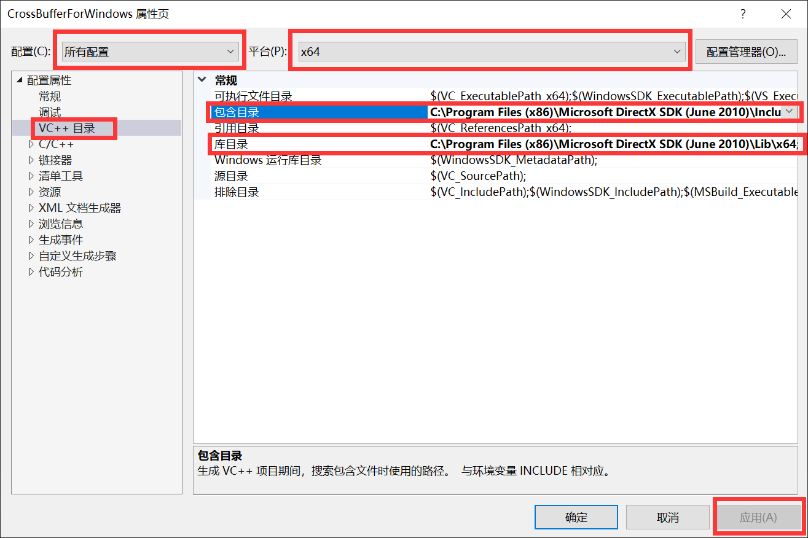

# 如何编译并运行Demo？ (Windows 平台)

## 说明：为什么需要依赖？

虽然本项目是纯数学推导的项目，理论上只需要纯C/C++即可实现，无需依赖库；但Windows和Linux系统都有保护限制，不允许C/C++程序直接访问显存。

所以，我们需要如下依赖：

- Windows：依赖于DirectX SDK 9.0 (June 2010)来操作显存
- Linux：依赖于SDL来操作显存

这里，特别容易引起误解的是DirectX SDK 9.0 (June 2010)，因为这个依赖库本身就可以实现3D功能。在这里，我需要澄清：本项目没有调用任何DirectX的3D API，仅仅用它操作显存。

证据如下：

- 第一：如果你阅读源代码，会发现所有光栅化渲染过程都是纯数学运算，没有调用DirectX的3D API
- 第二：Linux端的SDL并不包含3D API。如果在Windows端调用了DirectX的3D API，程序在Linux端就会无法运行。

Anyway, Have Fun in the Project!

## Windows平台编译说明

- Windows平台的编译非常简单，“开箱即用”，只需要您安装Visual Studio 2015，然后打开项目，点击“编译”按钮即可。

- 如果您安装的是Visual Studio 2017、2019、2022等更新版本，只需少量设置，请直接跳到“第七步”。

- 如果您遇到问题（例如无法编译），请按照以下流程来解决。

- 附：无法编译的原因

  本项目在开发中，并不是每一个commit都“开箱即用”。如果您Reset到之前的任意一个commit，大概率是无法直接运行的，需要按照下面步骤设置。

## 1. 解压

- 在`C:\Program Files (x86)`目录下新建文件夹，重命名为`Microsoft DirectX SDK (June 2010)`。

- 解压本目录下面的`DXSDK_Jun10_最精简免安装绿色包.rar`

- 把解压的内容复制到刚才新建的文件夹下面，确保目录名准确无误：

  `C:\Program Files (x86)\Microsoft DirectX SDK (June 2010)`

## 2. 打开项目设置

打开项目，在右边的“解决方案管理器”中右击项目，点属性，就可以进入项目设置：


## 3. 添加附加依赖项

- 对：所有配置、所有平台

- 打开：链接器——输入——附加依赖项——编辑

  

- 输入如下内容，点击确定：

  ```
  dxerr.lib
  dxguid.lib
  d3dx9.lib
  d3dx10.lib
  d3d9.lib
  winmm.lib
  comctl32.lib
  ```

  

- 点击“应用”（很重要）：

  

## 4. 配置32位依赖目录

- 对：所有配置、Win32

- 进入：`VC++目录`

- 添加“包含目录”为：

  ```
  C:\Program Files (x86)\Microsoft DirectX SDK (June 2010)\Include
  ```

- 添加“库目录”为：

  ```
  C:\Program Files (x86)\Microsoft DirectX SDK (June 2010)\Lib\x86
  ```

- 点击“应用”（重要）：

- 

## 5. 配置64位依赖目录

- 对：所有配置、x64

- 进入：`VC++目录`

- 添加“包含目录”为：

  ```
  C:\Program Files (x86)\Microsoft DirectX SDK (June 2010)\Include
  ```

- 添加“库目录”为：

  ```
  C:\Program Files (x86)\Microsoft DirectX SDK (June 2010)\Lib\x64
  ```

- 点击“应用”（重要）：

- 

## 6. 解除Runtime依赖

当我们把编译好的`EXE`程序发给其他人，会发现无法打开。这是因为默认编译的程序依赖于VS2015 Runtime，只有安装了VS2015开发工具或者VS2015 Runtime的人才能打开。

这种不兼容性是很不方便的。我们可以通过改变运行库，来解决这个问题：

- `/MT` `/MTd`：不依赖于Runtime
- `/MD` `/MDd`：依赖于Runtime

### 操作方法（Debug）

- 对：Debug、所有平台
- 进入：C/C++——代码生成
- 设置运行库为`/MTd`：
- 点击“应用”（重要）
- 

### 操作方法（Release）

- 对：Release、所有平台
- 进入：C/C++——代码生成
- 设置运行库为`/MT`：
- 点击“应用”（重要）
- 

## 7. `MSB802`报错解决方法

如果发现这个错误：


这是由于每个开发者安装的VS Build Tools版本不一样导致的。请这样解决：

- 对：所有配置、所有平台

- 打开：常规

- 把“平台工具集”和“目标平台版本”设置为你安装的工具集（不管是什么版本都可以）。

  例如：我安装了`v140`和`8.1`，就选择`v140`和`8.1`

- 点击“应用”

- 