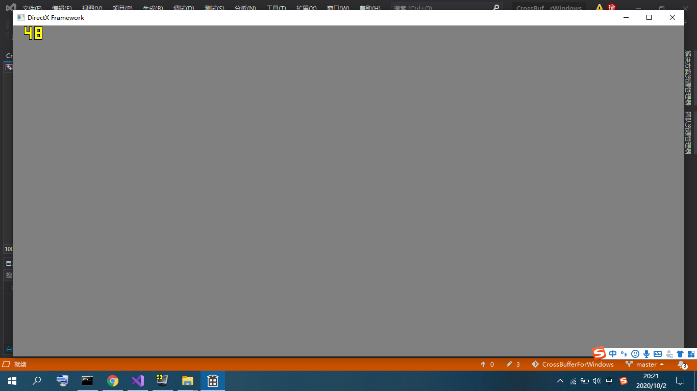

# JackieEngine

基于跨平台的显存框架CrossBuffer实现，一个完全基于数学运算的软渲染引擎。

注意！这个引擎正在开发中，尚未完成。不保证每一个Commit都能正常运行。

# 如何把项目运行起来（环境配置）

1.下载并运行DirectX9.0 SDK安装包（DXSDK_Jun10.exe），由于DXSDK不是开源的，这里就不放文件了，放个网上的链接，侵删：链接: http://pan.baidu.com/s/1gfkqSMZ 密码: r6my

2.选择安装到C:\Program Files (x86)\Microsoft DirectX SDK (June 2010)，默认地址应该就是这个。

3.安装程序最终会出现S1023错误，但这是正常现象，不影响使用。

4.安装完成后打开仓库中的JackieEngine.vcxproj，就会自动在VS中打开JackieEngine项目。在右边的“解决方案管理器”中右击项目，点属性，然后按照下面三张图设置：

5.设置完成后就可以使用了，点击画面上方的“本地Windows调试器”进行编译运行。

# 关于开源协议

仓库中JackieEngine本身，以及通过该程序衍生得产品，如Demo视频，均属于开源软件，遵守GNU通用公共许可证，即GNU GPL。

GNU GPL协议授予程序接受人以下权利，或称“自由”：

- 以任何目的运行此程序的自由；

- 再发行复制件的自由；

- 改进此程序，并公开发布改进的自由。

GNU GPL不会授予许可证接受人无限的权利。再发行权的授予需要许可证接受人开放软件的源代码，及所有修改。且复制件、修改版本，都必须以GPL为许可证，这是为了确保任何使用者不会独自占有开源软件。使用、复制或更改JackieEngine的程序接受人视为同意GNU GPL协议，必须再次开源其更改后的派生物（如源代码等），否则将追究法律责任。

关于协议版本，JackieEngine使用GPL v2协议。

关于GPL v2协议，上述说明仅做参考，具体细节请以LICENSE为准，

JackieEngine原作者杰基爵士SirJackie(曾用名Jackie Lin、Jakes、lyj00912，GitHub：https://github.com/SirJackie，Gitee：https://gitee.com/SirJackie，Bilibili：https://space.bilibili.com/354290931 ，博客园：https://www.cnblogs.com/SirJackie)保留一切解释权。