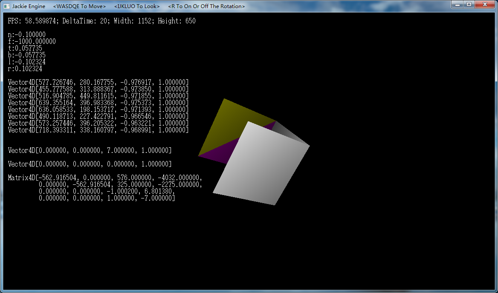
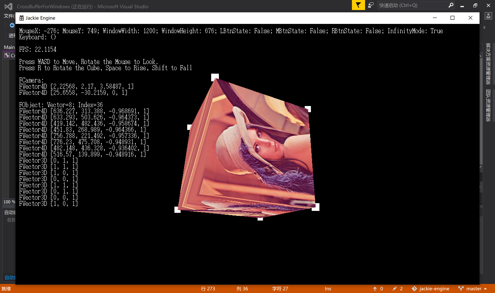

# JackieEngine

一个完全基于数学运算的软渲染3D引擎，不依赖GPU硬件加速，完全基于CPU运算实现的软件渲染。

注意！这个引擎正在开发中，尚未完成。不保证每一个Commit都能正常运行。

# Demos

## Demo1

使用`git checkout demo1`查看：

## Demo2

使用`git checkout demo2`查看：

# 如何编译并运行Demo？

[如何编译并运行Demo？ (Windows 平台)](./WindowsSimuLayer/ConfigurationDocument/ConfigurationDocument.md)

[如何编译并运行Demo？ (Linux 平台)](./LinuxSimuLayer/ConfigurationDocument/ConfigurationDocument.md)

# 关于开源协议

仓库中JackieEngine本身，以及通过该程序衍生得产品，如Demo视频，均属于开源软件，遵守GNU通用公共许可证，即GNU GPL。

GNU GPL协议授予程序接受人以下权利，或称“自由”：

- 以任何目的运行此程序的自由；

- 再发行复制件的自由；

- 改进此程序，并公开发布改进的自由。

GNU GPL不会授予许可证接受人无限的权利。再发行权的授予需要许可证接受人开放软件的源代码，及所有修改。且复制件、修改版本，都必须以GPL为许可证，这是为了确保任何使用者不会独自占有开源软件。使用、复制或更改JackieEngine的程序接受人视为同意GNU GPL协议，必须再次开源其更改后的派生物（如源代码等），否则将追究法律责任。

关于协议版本，JackieEngine使用GPL v2协议。

关于GPL v2协议，上述说明仅做参考，具体细节请以LICENSE为准，

JackieEngine原作者杰基爵士SirJackie(曾用名Jackie Lin、Jakes、lyj00912，GitHub：https://github.com/SirJackie，Gitee：https://gitee.com/SirJackie，Bilibili：https://space.bilibili.com/354290931 ，博客园：https://www.cnblogs.com/SirJackie)保留一切解释权。