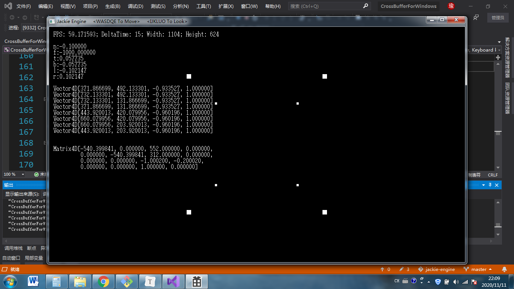

# CrossBufferForWindow

基于DirectX9.0的FrameBuffer实现，可以帮助你在Windows环境下读写显存。


# 如何把项目运行起来（环境配置）

1.下载并运行DirectX9.0 SDK安装包（DXSDK_Jun10.exe），由于DXSDK不是开源的，这里就不放文件了，放个网上的链接，侵删：链接: http://pan.baidu.com/s/1gfkqSMZ 密码: r6my


2.选择安装到C:\Program Files (x86)\Microsoft DirectX SDK (June 2010)，默认地址应该就是这个。


3.安装程序最终会出现S1023错误，但这是正常现象，不影响使用。


4.安装完成后打开仓库中的CrossBufferForWindow.vcxproj，就会自动在VS中打开CrossBufferForWindow项目。在右边的“解决方案管理器”中右击项目，点属性，然后按照下面三张图设置：


5.设置完成后就可以使用了，点击画面上方的“本地Windows调试器”进行编译运行。不出所料的话，你应该会看到一个颜色渐变的Demo。在6代i3，纯CPU环境下能稳定在48帧，Ryzen 3600，纯CPU环境下能稳定在50帧，还算不错。



# APIs

CrossBuffer希望提供一个跨平台的显存读写环境，这样你的代码就可以轻松复用，无需移植！

CrossBuffer在各个平台上都提供Main.h文件，通过修改这个文件，你就可以操作显存、键盘、鼠标、计时等等设备和功能。

Main.h包含4个函数：

```
#include "CrossBuffer.h"
#include "Input.h"

void OnCreate() {
	;
}

void Setup(FrameBuffer fb, int width, int height, int deltaTime, Keyboard keyboard, Mouse mouse) {
	;
}

void Update(FrameBuffer fb, int width, int height, int deltaTime, Keyboard keyboard, Mouse mouse) {
	;
}

void OnDestroy() {
	;
}

```

OnCreate()在显存建立之前被调用，没有参数。

Setup()在显存建立后第一帧被调用，参数：

- fb：显存
- width：屏幕宽度
- height：屏幕高度
- deltaTime：这一帧和上一帧的间隔时间（毫秒为单位，在Setup中由于是第一帧，所以为0）
- keyboard：键盘对象
- mouse：鼠标对象

Update()在显存建立后除了第一帧以外的每一帧被调用，参数：

- fb：显存
- width：屏幕宽度
- height：屏幕高度
- deltaTime：这一帧和上一帧的间隔时间（毫秒为单位）
- keyboard：键盘对象
- mouse：鼠标对象

OnDestroy()在显存释放后被调用，没有参数。

另外要注意：

- 如果需要使用fb显存对象，需要#include "CrossBuffer.h"。
- 如果需要使用keyboard或mouse对象，需要#include "Input.h"。
- 如果需要在显存上显示文字，需要#include "TextOutput.h"。

这些库的使用方法参见工程中的Main.h文件，这里就不做详细说明了。如果有问题，请Issue我，我看到后会进行解释。

Enjoy it！

# 关于开源协议

仓库中CrossBufferForWindow本身，以及通过该程序衍生得产品，如Demo视频，均属于开源软件，遵守GNU通用公共许可证，即GNU GPL。

GNU GPL协议授予程序接受人以下权利，或称“自由”：

- 以任何目的运行此程序的自由；

- 再发行复制件的自由；

- 改进此程序，并公开发布改进的自由。

GNU GPL不会授予许可证接受人无限的权利。再发行权的授予需要许可证接受人开放软件的源代码，及所有修改。且复制件、修改版本，都必须以GPL为许可证，这是为了确保任何使用者不会独自占有开源软件。使用、复制或更改CrossBufferForWindow的程序接受人视为同意GNU GPL协议，必须再次开源其更改后的派生物（如源代码等），否则将追究法律责任。

关于协议版本，CrossBufferForWindow使用GPL v2协议。

关于GPL v2协议，上述说明仅做参考，具体细节请以LICENSE为准，

Duino3D原作者杰基爵士SirJackie(曾用名Jackie Lin、Jakes、lyj00912，GitHub：https://github.com/SirJackie，Gitee：https://gitee.com/SirJackie，Bilibili：https://space.bilibili.com/354290931 ，博客园：https://www.cnblogs.com/SirJackie)保留一切解释权。